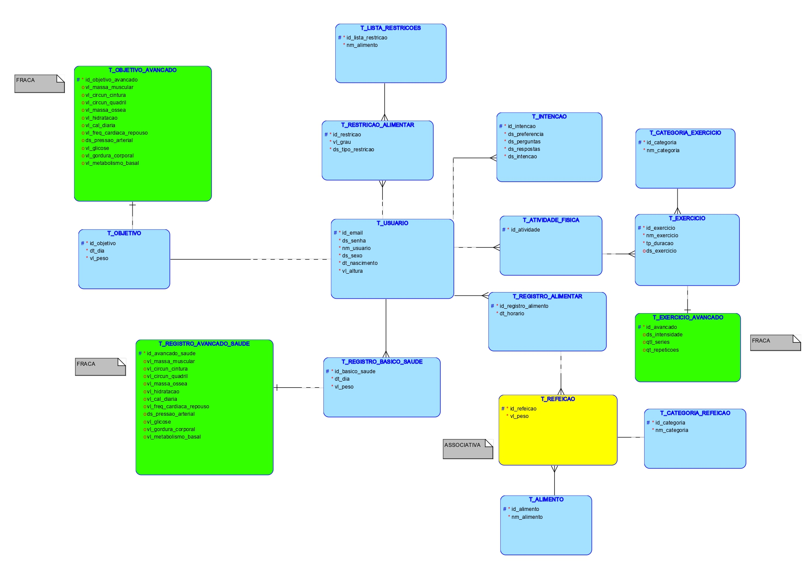
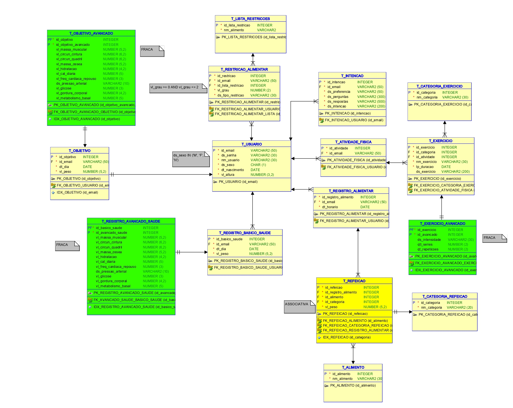
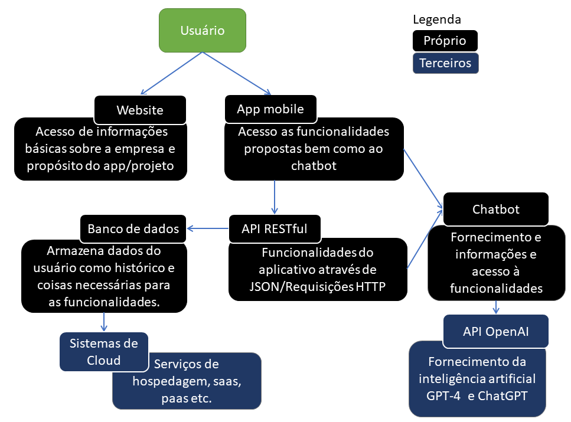

# Fit AI

Projeto destinado à faculdade, é um aplicativo com um chatbot que usará de inteligencia artificial para auxiliar o usuário com sua alimentação e controle de sua saúde.


# Sobre o projeto

A alimentação saudável é fundamental para a saúde e o bem-estar, no entanto, muitas pessoas têm dificuldades para entender o que é uma dieta equilibrada e quais alimentos são mais adequados para o seu corpo. Além disso, a prática regular de atividades físicas é essencial para manter uma vida saudável. Para ajudar a solucionar essas questões, uma IA pode ser desenvolvida com o objetivo de auxiliar pessoas leigas a saberem como se alimentar melhor e compartilhar exercícios físicos que elas possam fazer.

A utilização da API do ChatGPT para fornecer informações nutricionais personalizadas através de um aplicativo mobile é uma tendência crescente, já que as pessoas estão cada vez mais interessadas em cuidar da sua saúde e bem-estar. Uma das principais vantagens da utilização da API do ChatGPT em um aplicativo mobile de nutrição é a capacidade de fornecer respostas personalizadas e precisas para as perguntas dos usuários em tempo real.

Isso significa que, em vez de pesquisar na internet por horas em busca de informações confiáveis sobre nutrição, os usuários podem ter suas dúvidas esclarecidas rapidamente, sem precisar sair do aplicativo.

## Estrutura do aplicativo

O sistema irá girar em torno do usuário. Ele pode ter um e-mail, uma senha, nome, sexo, data de nascimento e altura.

Atrelado a ele estarão suas restrições alimentares, que compõem o grau e a restrição.

Também atrelado a ele também estarão suas atividades físicas, com uma descrição do exercício feito composto por categoria, nome, duração e uma descrição opcional. Para usuários avançados, poderá ter a intensidade, a quantidade de series e de repetições.

Ainda atrelado ao usuário deverá haver seu registro alimentar. Composto por hora que ele comeu, o alimento, qual a categoria da refeição (por exemplo: se foi almoço ou jantar) e o peso.

O usuário também terá um registro de saúde. Nele estarão informações como o dia e o peso que ele está. Para usuários avançados, poderão registrar sua massa muscular, circunferência da cintura e do quadril, massa óssea, hidratação, calorias diárias, frequência cardíaca em repouso, pressão arterial, glicose, gordura corporal e metabolismo basal.

O usuário também poderá ter um objetivo atrelado a ele composto pelos mesmos campos do registro de saúde.

## Regras de negócio

Algumas regras já definidas mas que não se limitam a somente essas e também podem ser alteradas a qualquer momento são:

RN01 - Todas as categorias devem ser referenciadas por uma tabela auxiliar onde estarão cadastradas as já existentes sem inserção de dados pelo usuário. Por exemplo: categorias de exercícios devem estar todas inseridas nessa tabela, como cardiovascular etc.

RN02 – Totas os campos avançados devem ser referenciados como uma tabela extra opcional para evitar acúmulo de campos nulos.

RN03 – O sexo do usuário deve ser descrito por M – masculino, F- feminino e N – não informado.

RN04 – O nível de restrição deve ser limitado à 0 para restrição voluntária, 1 para restrição parcial e 2 para restrição total.

RN05 – O histórico de conversas do usuário com o ChatBot deve ser armazenado numa tabela atrelada a ele.

## Diagramas

O modelo lógico e relacional foram desenvolvidos para expressar a maneira como o banco será. Mantemos a liberdade de possíveis alterações conforme necessidade.

Modelo lógico:


Modelo físico/relacional:


Diagrama da solução completa:


# Endpoints

- [Usuário](#usuário)
    - [Criar](#criar-usuário)
    - [Detalhes](#detalhes-do-usuário)
    - [Atualizar](#atualizar-dados-do-usuário)
    - [Apagar](#apagar-usuário)
    - [Listar](#listar-usuários)
- [Registro de saúde](#registro-de-saúde)
    - [Criar](#criar-registro-de-saúde)
    - [Detalhes](#detalhes-do-registro-de-saúde)
    - [Atualizar](#atualizar-registro-de-saúde)
    - [Apagar](#apagar-registro-de-saude)
    - [Listar](#listar-registros-de-saude)
- [Registro alimentar](#registro-alimentar)
    - [Criar](#criar-registro-alimentar)
    - [Detalhes](#detalhes-do-registro-alimentar)
    - [Atualizar](#atualizar-registro-alimentar)
    - [Apagar](#apagar-registro-alimentar)
    - [Listar](#listar-registros-alimentares)
- [Atividade física](#atividade-física)
    - [Criar](#criar-registro-físico)
    - [Detalhes](#detalhes-do-registro-físico)
    - [Atualizar](#atualizar-registro-físico)
    - [Apagar](#apagar-registro-físico)
    - [Listar](#listar-registros-físicos)

## Usuário

### Criar usuário
---

`POST` /api/usuario

*Campos de requisição*
| Campo | Tipo | Obrigatório | Descrição |
|-|-|:-:|-|
| email | texto | sim | id da conta|
| senha | texto | sim | senha da conta|
| nome | texto | sim | nome do titular da conta |
| sexo | texto | sim | F = feminino, M = masculino, N = não informado
| nascimento | data | sim | data de nascimento do titular |
| altura | flutuante | sim | altura do titular|
| idRestricao | lista de objetos | não | restrição alimentar
| objetivo| objeto | não | objetivo que quer alcançar|

<details>
    <summary>Clique aqui para ver os detlahes de como o objetivo deve ser preenchido</summary>

| Campo               | Tipo      | Obrigatório | Descrição                      |
|---------------------|-----------|:-----------:|--------------------------------|
| dia                 | data      |     sim     | dia desse registro             |
| peso                | flutuante |     sim     | peso do titular                |
| massaMuscular       | flutuante |     nao     | ---                            |
| circunCintura       | flutuante |     nao     | circunferencia da cintura      |
| circunQuadril       | flutuante |     nao     | circunferencia do quadril      |
| massaOssea          | flutuante |     nao     | ---                            |
| hidratacao          | flutuante |     nao     | ---                            |
| calDiaria           | inteiro   |     nao     | calorias diárias               |
| freqCardiacaRepouso | inteiro   |     nao     | frequencia cardíaca em repouso |
| pressaoArterial     | texto     |     nao     | ---                            |
| glicose             | inteiro   |     nao     | ---                            |
| gorduraCorporal     | flutuante |     nao     | ---                            |
| metabolismoBasal    | inteiro   |     nao     | ---                            |

*Exemplo de requisição com o objetivo*
```json
{
    "email": "exemplo@exemplo.com",
    "senha": "12345678",
    "nome": "Fulano",
    "sexo": "N",
    "nascimento": "01/01/2001",
    "altura": 1.85,
    "restricao": null,
    "objetivo": {
        "dia": "01/01/2024",
        "peso": 75,
        "massaMuscular": 39
    }
}
```
</details>

*Exemplo de requisição*
```json
{
    "email": "exemplo@exemplo.com",
    "senha": "12345678",
    "nome": "Fulano",
    "sexo": "N",
    "nascimento": "01/01/2001",
    "altura": 1.85,
    "restricao":null,
    "objetivo":null
}
```

*Resposta*
| código | descrição 
|-|-
|201| Usuário cadastrado com sucesso|
|400| Dados inválidos|

### Detalhes do usuário
---
*precisando de mudanças*

`GET` /api/usuario/{id}

*Exemplo de requisição*
```
    /api/usuario/exmeplo@exemplo.com
```
*Exemplo de resposta*
```json
{
    "email": "exemplo@exemplo.com",
    "senha": "12345678",
    "nome": "Fulano",
    "sexo": "N",
    "nascimento": "01/01/2001",
    "altura": 1.85,
    "restricao":null,
    "objetivo":null
}
```

*Resposta*
| código | descrição 
|-|-
|200| Os dados foram retornados |
|404| Nao foi encontrada uma conta com esse ID |

### Atualizar dados do usuário

`PUT` /api/usuario/{id}

*Exemplo de requisição*
```json
{
    "email": "exemplo@exemplo.com",
    "senha": "12345678",
    "nome": "Ciclano",
    "sexo": "N",
    "nascimento": "01/01/2001",
    "altura": 1.85,
    "restricao":null,
    "objetivo":null
}
```

*Resposta*
| código | descrição 
|-|-
|200| Conta editada com sucesso|
|404| Conta não encontrada

### Apagar usuário
---

`DELETE` /api/usuario/{id}

*Exemplo de requisição*
```
    /api/usuario/exemplo@exemplo.com
```

### Listar usuários
---

`GET` /api/usuario

*Exemplo de resposta*
```json
[{
    "email": "exemplo@exemplo.com",
    "senha": "12345678",
    "nome": "Fulano",
    "sexo": "N",
    "nascimento": "01/01/2001",
    "altura": 1.85,
    "restricao":null,
    "objetivo":null
},
{
    "email": "outroexemplo@exemplo.com",
    "senha": "87654321",
    "nome": "Ciclano",
    "sexo": "F",
    "nascimento": "02/02/2002",
    "altura": 1.58,
    "restricao":null,
    "objetivo":null
}]
```

## Registro de saúde

### Criar registro de saúde
---

`POST` /api/usuario/{idUsuario}/saude

*Campos de requisição*
| Campo | Tipo | Obrigatório | Descrição |
|-|-|:-:|-|
| id | longo | sim | id do registro gerado automaticamente |
| idUsuario | texto | sim | id do usuário dono do registro
| dia | data | sim | dia desse registro |
| peso | flutuante | sim | peso do titular
| massaMuscular | flutuante | nao | ---
| circunCintura | flutuante | nao | circunferencia da cintura
| circunQuadril | flutuante | nao | circunferencia do quadril
| massaOssea | flutuante | nao | ---
| hidratacao | flutuante | nao | ---
| calDiaria | inteiro | nao | calorias diárias
| freqCardiacaRepouso | inteiro | nao | frequencia cardíaca em repouso
| pressaoArterial | texto | nao | ---
| glicose | inteiro | nao | ---
| gorduraCorporal | flutuante | nao | ---
| metabolismoBasal | inteiro | nao | ---


*Exemplo de requisição*
```
    /api/usuario/exemplo@exemplo.com/saude/
```
```json
{
    "dia":"01/01/2001",
    "peso": 85,
    "avancado": {
        "circunCintura": 30
    }
}
```

*Resposta*
| código | descrição 
|-|-
|201| Registro de saúde criado com sucesso|
|400| Dados inválidos|
|404| usuário não encontrado|

### Detalhes do registro de saúde
---
*precisando de mudanças*

`GET` /api/usuario/{idUsuario}/saude/{id}

*Exemplo de resposta*
```json
{
    "id": 1,
    "idUsuario":"exemplo@exemplo.com",
    "dia": "01/01/2001",
    "peso": 85,
    "avancado": {
        "massaMuscular": null,
        "circunCintura": 30,
        "circunQuadril": null,
        "massaOssea": null,
        "hridratacao":null,
        "calDiaria":null,
        "freqCardiacaRepouso":null,
        "pressaoArterial": null,
        "glicose":null,
        "gorduraCorporal":null,
        "metabolismoBasal":null
    }
}
```

*Resposta*
| código | descrição 
|-|-
|200| Os dados foram retornados |
|404| Nao foi encontrada um usuario ou registro |

### Atualizar registro de saúde

`PUT` /api/usuario/{idUsuario}/saude/{id}

*Exemplo de requisição*
```json
{
    "id": 1,
    "idUsuario":"exemplo@exemplo.com",
    "dia": "01/01/2001",
    "peso": 85,
    "avancado": {
        "massaMuscular": null,
        "circunCintura": 30,
        "circunQuadril": null,
        "massaOssea": null,
        "hridratacao":null,
        "calDiaria": 50,
        "freqCardiacaRepouso":null,
        "pressaoArterial": null,
        "glicose":null,
        "gorduraCorporal":null,
        "metabolismoBasal":null
    }
}
```

*Resposta*
| código | descrição 
|-|-
|200| Conta editada com sucesso|
|404| Conta não encontrada

### Apagar registro de saude
---

`DELETE` /api/usuario/{idUsuario}/saude/{id}

*Exemplo de requisição*
```
    /techbridge/api/conta/exemplo@exemplo.com
```

### Listar registros de saude
---

`GET` /api/usuario/{idUsuario}/saude

*Exemplo de resposta*
```json
[{
    "id": 1,
    "idUsuario":"exemplo@exemplo.com",
    "dia": "01/01/2001",
    "peso": 85,
    "avancado": {
        "massaMuscular": null,
        "circunCintura": 30,
        "circunQuadril": null,
        "massaOssea": null,
        "hridratacao":null,
        "calDiaria": 50,
        "freqCardiacaRepouso":null,
        "pressaoArterial": null,
        "glicose":null,
        "gorduraCorporal":null,
        "metabolismoBasal":null
    }
}
{
    "id": 2,
    "idUsuario":"outroexemplo@exemplo.com",
    "dia": "01/01/2001",
    "peso": 85,
    "avancado": {
        "massaMuscular": null,
        "circunCintura": 30,
        "circunQuadril": null,
        "massaOssea": null,
        "hridratacao":null,
        "calDiaria": 50,
        "freqCardiacaRepouso":null,
        "pressaoArterial": null,
        "glicose":null,
        "gorduraCorporal":null,
        "metabolismoBasal":null
    }
}]
```

## Registro alimentar

### Criar registro alimentar
---

`POST` /api/usuario/{idUsuario}/alimentar

*Campos de requisição*
| Campo | Tipo | Obrigatório | Descrição |
|-|-|:-:|-|
| id | longo | sim | id do registro gerado automaticamente |
| idUsuario | texto | sim | id do usuário dono do registro
| horario | data | sim | horário do momento da refeição
| idRefeicao | longo | sim | id da refeição
| idAlimento | Lista longa | sim | ids dos alimentos inclusos nessa refeição
| idCategoria | inteiro | sim | id para almoço, jantar etc.
| peso | flutuante | sim | peso do alimento

*Exemplo de requisição*
```json
{
    "id": 1,
    "horario": "01/01/2021-13-31",
    "idRefeicao": 1,
    "idAlimento": [43],
    "idCategoria": 2,
    "peso": 145
}
```

*Resposta*
| código | descrição 
|-|-
|201| Registro de alimento criado com sucesso|
|400| Dados inválidos|
|404| usuário não encontrado|

### Detalhes do registro alimentar
---
*precisando de mudanças*

`GET` /api/usuario/{idUsuario}/alimentar/{id}

*Exemplo de resposta*
```json
{
    "idUsuario": 1,
    "id": 1,
    "horario": "01/01/2021-13-31",
    "idRefeicao": 1,
    "idAlimento": [43],
    "idCategoria": 2,
    "peso": 145
}
```

*Resposta*
| código | descrição 
|-|-
|200| Os dados foram retornados |
|404| Nao foi encontrada um usuario ou registro |

### Atualizar registro alimentar

`PUT` /api/usuario/{idUsuario}/alimentar/{id}

*Exemplo de requisição*
```json
{
    "idUsuario": 1,
    "id": 1,
    "horario": "01/01/2021-13-31",
    "idRefeicao": 1,
    "idAlimento": [43,23],
    "idCategoria": 2,
    "peso": 145
}
```

*Resposta*
| código | descrição 
|-|-
|200| Conta editada com sucesso|
|404| Conta não encontrada

### Apagar registro alimentar
---

`DELETE` /api/usuario/{idUsuario}/alimentar/{id}

*Exemplo de requisição*
```
    /api/usuario/exemplo@exemplo.com/alimentar/1
```

### Listar registros alimentares
---

`GET` /api/usuario/{idUsuario}/alimentar

*Exemplo de resposta*
```json
[{
    "idUsuario": 1,
    "id": 1,
    "horario": "01/01/2021-13-31",
    "idRefeicao": 1,
    "idAlimento": [43],
    "idCategoria": 2,
    "peso": 145
}
{
    "idUsuario": 1,
    "id": 2,
    "horario": "01/01/2021-13-31",
    "idRefeicao": 1,
    "idAlimento": [43,65],
    "idCategoria": 2,
    "peso": 145
}]
```

## Registro físico

### Criar registro físico
---

`POST` /api/usuario/{idUsuario}/fisico

*Campos de requisição*
| Campo | Tipo | Obrigatório | Descrição |
|-|-|:-:|-|
| id | longo | sim | id do registro gerado automaticamente |
| idExercicio| sim | id do exercício gerado automaticamente
| hora | sim | horario do exercicio
| idCategoria | sim | categoria do exercicio
| nomeExercicio | sim | ---
| duracao | sim | duração do exercicio
| descricao | não | descrição do exercício
| intensidade | não | intensidade do exercício
| qtSeries | não | quantidade de séries
| qtRepeticoes | não | quantidade de repetições

*Exemplo de requisição*
```json
{
    "hora": "21/12/2021-12-21",
    "idCategoria": 3,
    "nomeExercicio": "Caminhada",
    "duracao": "00-30"
}
```

*Resposta*
| código | descrição 
|-|-
|201| Registro físico criado com sucesso|
|400| Dados inválidos|
|404| usuário não encontrado|

### Detalhes do registro físico
---
*precisando de mudanças*

`GET` /api/usuario/{idUsuario}/fisico/{id}

*Exemplo de resposta*
```json
{
    "id": 1,
    "idUsuario": 1,
    "hora": "21/12/2021-12-21",
    "idCategoria": 3,
    "nomeExercicio": "Caminhada",
    "duracao": "00-30",
    "descricao":null,
    "intensidade":null,
    "qtSeries":null,
    "qtRepeticoes": null
}
```

*Resposta*
| código | descrição 
|-|-
|200| Os dados foram retornados |
|404| Nao foi encontrada um usuario ou registro |

### Atualizar registro físico

`PUT` /api/usuario/{idUsuario}/fisico/{id}

*Exemplo de requisição*
```json
{
    "hora": "21/12/2021-12-21",
    "idCategoria": 3,
    "nomeExercicio": "Corrida",
    "duracao": "00-30",
    "descricao":null,
    "intensidade":null,
    "qtSeries":null,
    "qtRepeticoes": null
}
```

*Resposta*
| código | descrição 
|-|-
|200| Conta editada com sucesso|
|404| Conta não encontrada

### Apagar registro físico
---

`DELETE` /api/usuario/{idUsuario}/alimentar/{id}

*Exemplo de requisição*
```
    /api/usuario/exemplo@exemplo.com/fisico/1
```

### Listar registros físicos
---

`GET` /api/usuario/{idUsuario}/fisico

*Exemplo de resposta*
```json
[{
    "hora": "21/12/2021-12-21",
    "idCategoria": 3,
    "nomeExercicio": "Caminhada",
    "duracao": "00-30",
    "descricao":"caminhada no parque em frente ao mercado",
    "intensidade":null,
    "qtSeries":null,
    "qtRepeticoes": null
}
{
    "hora": "21/12/2021-12-21",
    "idCategoria": 3,
    "nomeExercicio": "Caminhada",
    "duracao": "00-30",
    "descricao":null,
    "intensidade":null,
    "qtSeries":null,
    "qtRepeticoes": null
}]
```